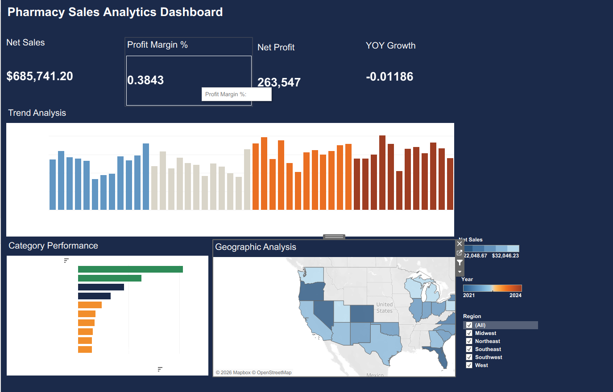

# 💊 Pharmacy Sales Analytics Dashboard
### Interactive Tableau Dashboard | End-to-End Data Analytics Project



> **Note:** Replace the image above with a screenshot of your completed Tableau dashboard.  
> Save it as `docs/assets/dashboard_preview.png` after building.

---

## 📋 Project Overview

This end-to-end analytics project simulates a real-world pharmacy chain analytics workflow. It demonstrates data generation, cleaning, KPI definition, and interactive Tableau dashboard design across **5,000 transactions**, **10 product categories**, **5 US regions**, and **4 years (2021–2024)** of sales data.

**Built for:** Portfolio projects, analytics interviews, Tableau skill demonstrations.

---

## 🎯 Business Questions Answered

| # | Business Question | Visualization |
|---|-------------------|---------------|
| Q1 | Are pharmacy revenues growing year-over-year? | Line Trend Chart |
| Q2 | Which months show seasonal revenue spikes? | Monthly Trend Chart |
| Q3 | Which product categories have the highest profit margins? | Bar Chart |
| Q4 | Are high-revenue categories also high-margin? | Dual-Axis Bar |
| Q5 | Which US states and regions drive the most sales? | Filled State Map |
| Q6 | How much revenue is lost to discounting? | KPI Tile |
| Q7 | Which customer segments generate the most revenue? | Segment Filter |
| Q8 | What is our prescription refill rate (loyalty proxy)? | KPI Tile |
| Q9 | How does profitability vary geographically? | Map + Tooltip |
| Q10 | Which regions are underperforming and need attention? | Map + Region Rank |

---

## 📊 KPIs & Metrics

| KPI | Definition | Target |
|-----|-----------|--------|
| **Total Net Sales** | Revenue after discounts | > $170K/year |
| **Total Net Profit** | Net Sales − COGS | > $65K/year |
| **Profit Margin %** | Net Profit / Net Sales | ≥ 35% |
| **YoY Sales Growth %** | (CY − PY) / PY | ≥ 8% |
| **Refill Rate %** | Refill Txns / All Txns | ≥ 45% |
| **Avg Revenue / Transaction** | Net Sales / Distinct Transactions | > $140 |
| **Discount Impact $** | Total discount dollars given | Monitor trend |

---

## 📁 Repository Structure

```
pharmacy-tableau-dashboard/
│
├── 📂 data/
│   ├── pharmacy_sales.csv              ← Raw generated dataset (5,000 rows)
│   └── pharmacy_sales_clean.csv        ← Cleaned, Tableau-ready dataset (26 cols)
│
├── 📂 scripts/
│   ├── generate_data.py                ← Synthetic data generator
│   └── data_prep.py                    ← Data cleaning & validation script
│
├── 📂 tableau/
│   ├── calculated_fields.md            ← All Tableau formula definitions
│   ├── dashboard_build_guide.md        ← Step-by-step Tableau build instructions
│   └── pharmacy_dashboard.twbx         ← ⬅ Add after building in Tableau Desktop
│
├── 📂 docs/
│   ├── business_questions_kpis.md      ← Full KPI definitions & data dictionary
│   ├── github_upload_guide.md          ← Git/GitHub setup and upload instructions
│   └── assets/
│       └── dashboard_preview.png       ← ⬅ Add screenshot of your dashboard
│
├── .gitignore
├── LICENSE
└── README.md
```

---

## 🚀 Quick Start

### Option A — Use the Pre-Built Data (Fastest)
1. Download `data/pharmacy_sales_clean.csv`
2. Open Tableau Desktop → Connect → Text File → select the CSV
3. Follow `tableau/dashboard_build_guide.md` to build the dashboard

### Option B — Regenerate Data from Scratch
```bash
# Clone the repo
git clone https://github.com/YOUR-USERNAME/pharmacy-tableau-dashboard.git
cd pharmacy-tableau-dashboard

# Generate raw dataset (requires Python 3.8+, no extra libraries needed)
python scripts/generate_data.py

# Clean and validate the data
python scripts/data_prep.py

# Now open Tableau and connect to data/pharmacy_sales_clean.csv
```

---

## 🏗️ Dashboard Architecture

```
┌─────────────────────────────────────────────────────────────────────┐
│  💊 Pharmacy Analytics Dashboard                                    │
├──────────┬──────────┬──────────┬──────────┬──────────────────────── ┤
│ $685K    │ $264K    │  38.4%   │  +8.2%   │  FILTERS               │
│ Net Sales│ Net Prof.│ Margin   │ YoY Grwth│  ▸ Year (2021–2024)    │
│  KPI     │  KPI     │  KPI     │  KPI     │  ▸ Region              │
├──────────┴──────────┴──────────┴──────────┤  ▸ Product Category    │
│                                           │  ▸ Customer Segment    │
│  📈 Monthly Net Sales Trend               │  ▸ Payment Type        │
│      (Line Chart — 2021–2024)             │                        │
│                                           │  TOP N SELECTOR        │
├───────────────────────┬───────────────────┤  ▸ Show Top 1–10 Cats  │
│                       │                   │                        │
│  🗺️ Net Sales by State│ 📊 Category       │                        │
│   (Filled Map)        │    Performance    │                        │
│                       │    (Bar Chart)    │                        │
└───────────────────────┴───────────────────┴────────────────────────┘
```

### Dashboard Views

| View | Type | Primary Insight |
|------|------|-----------------|
| **KPI Banner** | Big Number Tiles | Headline metrics at a glance |
| **Trend Analysis** | Line Chart | Revenue seasonality & YoY comparison |
| **Geographic Analysis** | Filled Map | State-level performance heatmap |
| **Category Performance** | Bar Chart | Top categories by sales & margin |

### Interactive Actions
- **Map → Bar Chart:** Click a state/region to filter the category breakdown
- **Bar Chart → Trend:** Hover on a category to highlight its trend line
- **Year Filter → All Views:** Select a year to update every chart simultaneously
- **Top N Selector:** Parameter slider to show Top 1–10 product categories

---

## 🛠️ Technical Stack

| Tool | Version | Purpose |
|------|---------|---------|
| **Tableau Desktop** | 2023.1+ | Dashboard creation & visualization |
| **Tableau Public** | Free | Publishing & sharing |
| **Python** | 3.8+ | Data generation & cleaning |
| **CSV** | — | Data interchange format |
| **Git / GitHub** | — | Version control & sharing |

**Python standard library only** — no `pandas`, `numpy`, or external packages required.

---

## 📐 Data Model

```
pharmacy_sales_clean.csv  (flat file — 5,000 rows × 26 columns)
│
├── Time Dimensions    Date, Year, Month, Month_Num, Quarter, Fiscal_Period
├── Geography          Region, State
├── Product            Product_Category, Product_Name
├── Customer           Customer_Segment, Insurance_Provider, Payment_Type
├── Transaction        Transaction_ID, Quantity, Unit_Price, Is_Refill
└── Financials         Gross_Sales, Discount_Pct, Discount_Amount,
                       Net_Sales, COGS, Gross_Profit, Net_Profit,
                       Profit_Margin_Pct, Revenue_Per_Unit
```

**Date Range:** January 1, 2021 — December 31, 2024  
**Regions:** Northeast, Southeast, Midwest, Southwest, West  
**Product Categories:** Pain Relief, Antibiotics, Cardiovascular, Diabetes Care, Mental Health, Vitamins & Supplements, Allergy & Sinus, Gastrointestinal, Dermatology, Cold & Flu  
**Note:** Data is synthetically generated and does not represent any real pharmacy.

---

## 📖 Documentation

| Document | Description |
|----------|-------------|
| [`docs/business_questions_kpis.md`](docs/business_questions_kpis.md) | Full KPI definitions, business questions, data dictionary |
| [`tableau/calculated_fields.md`](tableau/calculated_fields.md) | Every Tableau calculated field formula with explanations |
| [`tableau/dashboard_build_guide.md`](tableau/dashboard_build_guide.md) | Step-by-step Tableau build instructions (Views 1–3, KPIs, Actions) |
| [`docs/github_upload_guide.md`](docs/github_upload_guide.md) | Git setup, authentication, and push instructions |

---

## ✅ Definition of Done

- [x] Synthetic dataset generated (5,000 rows, 4 years)
- [x] Data cleaned and validated (0 nulls, correct types)
- [x] All KPIs defined in documentation
- [x] Calculated field formulas documented
- [x] Dashboard build instructions written
- [x] Tableau workbook built (View 1: Trend, View 2: Map, View 3: Bar)
- [x] 4 dashboard actions configured
- [x] KPI banner with 4 tiles
- [x] Global filter panel (Year, Region, Segment, Top N)
- [x] Dashboard screenshot added to `docs/assets/`
- [x] `.twbx` saved to `tableau/` folder
- [x] Published to Tableau Public
- [x] README live demo link updated
- [x] Final commit and push to GitHub

---

## 🤝 Contributing

Found a bug or want to improve the dashboard design?

1. Fork the repository
2. Create a feature branch: `git checkout -b feature/improve-map-tooltip`
3. Make your changes
4. Commit: `git commit -m "Improve geographic map tooltip formatting"`
5. Push: `git push origin feature/improve-map-tooltip`
6. Open a Pull Request

---

## 📄 License

This project is licensed under the **MIT License** — see the [LICENSE](LICENSE) file for details.

---

## 👤 Author

Apoorva Siri Mattewada
Data Analyst  

---

*Built with Tableau Desktop 2023.3+ and Python 3.11 | Pharmacy Analytics Dashboard v1.0*
